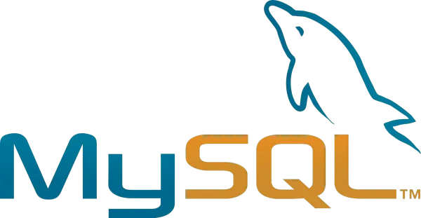

# learn-mysql

MySQL es un sistema de gestión de bases de datos relacional ampliamente utilizado que ofrece una plataforma robusta y escalable para almacenar y administrar datos. Este repositorio está destinado a proporcionar recursos y ejemplos prácticos para aprender y mejorar tus habilidades en MySQL.

<div>
 
  
</div>

## Ejemplos de Uso

En este repositorio, encontrarás ejemplos de uso de MySQL que abarcan diversos temas, como:

- Creación y administración de bases de datos.
- Consultas SQL y operaciones de lectura.
- Actualización y eliminación de datos.
- Optimización y rendimiento de consultas.
- Integración de MySQL con aplicaciones y lenguajes de programación.

## Estructura del Repositorio

La estructura del repositorio se organiza de la siguiente manera:

- `ejemplos/`: Carpeta que contiene ejemplos de código en SQL y scripts relacionados.
- `recursos/`: Carpeta con enlaces útiles, documentación y guías de referencia.
- `proyectos/`: Carpeta opcional para proyectos específicos relacionados con MySQL.
- `oracle/`: Carpeta con apuntes de Oracle SQL, tanto DDL como DML y DCL.

## Como usar este repositorio

```bash
git clone https://github.com/karlosvas/learn-mysql.git
cd learn-mysql
# Disfrutra leyendo los apuntes
```

```bash
# Utiliza la extensión oficial de oracle SQL Developer para Visual Studio Code, o cualquier otro IDE que soporte conexiones a bases de datos MySQL y Oracle.
# En mi caso uso la extensión junto con contenedores Docker para ejecutar MySQL y Oracle.
docker pull container-registry.oracle.com/database/enterprise:latest
docker images

# Esperar a que este healty
docker ps -a

# Crear un contenedor de MySQL
docker run -d --name oracle-db -p 1521:1521 -p 5500:5500 -e ORACLE_PWD=Passw0rd container-registry.oracle.com/database/enterprise:latest
```
